# Blondel — état de l'interface (existant, avant refonte UX/UI)

> **Document historique.** Il décrit l'interface d'avant la refonte (trois colonnes, état du 2026-09-30), remplacée entièrement par les parcours guidé et libre : voir [ADR-0009](../adr/0009-parcours-guide-libre.md) (décisions et « Mise en œuvre ») et les captures de la nouvelle interface dans [`captures-refonte/`](captures-refonte/). Il n'est plus tenu à jour ; ses captures (`captures/`) ne sont plus régénérées (`pnpm ux:captures` écrit désormais dans `captures-refonte/`).

> 2026-09-30. Document destiné au design : ce que l'application montre et permet **aujourd'hui**, avec des captures. Il décrit l'existant et ne prescrit rien. Les frictions relevées (§ 9) sont des constats à discuter, pas des décisions.
>
> Application en ligne : <https://glandais.github.io/blondel/>. Les captures sont produites par un script (`pnpm ux:captures`, voir § 11) : on les régénère après chaque évolution de l'interface.

## 1. En deux mots

Blondel est un logiciel web de **conception paramétrique d'escaliers** (bois, métal, mixte). On décrit le site (hauteur à monter, trémie, murs), la forme (droit, tournants, hélicoïdal), le découpage des marches et la structure (limons, profilés, tôles…). Blondel calcule alors l'escalier complet :

- les pièces et leurs développés de fabrication ;
- les garde-corps ;
- un **contrôle de conception** en temps réel (règles DTU, réglementation, règles de l'art) ;
- les exports d'atelier (PDF, DXF, CSV, glTF).

Tout tourne dans le navigateur, sans compte ni serveur ; le projet est autosauvegardé localement.

**Utilisateurs visés** :

- des **artisans** (menuisiers, métalliers, serruriers) qui conçoivent et fabriquent ;
- des visiteurs qui **explorent** les possibilités (vitrine, démos).

Il n'y a pas de parcours « particulier qui commande son escalier ». Le vocabulaire est celui du métier (voir le glossaire, § 10), et l'application affiche de nombreuses grandeurs techniques.

**Principes qui contraignent l'interface** (à conserver dans une refonte) :

- **L'interface ne calcule rien** : elle édite un _projet_ (données saisies) et affiche un _modèle_ calculé en arrière-plan (Web Worker, quelques dizaines de ms). Pendant un calcul, le dernier modèle reste affiché et la barre d'état indique « Calcul… ».
- **Le calcul ne plante jamais** : en cas de problème, il rend un modèle partiel et des erreurs lisibles (barre d'erreurs, § 6).
- **Les dessins 2D affichés sont les exports eux-mêmes** : le plan coté et l'élévation sont les SVG que l'on télécharge. Changer leur style, c'est changer celui des documents d'atelier.
- **Unités** : saisie en millimètres entiers ; affichage en mm ou en cm (réglage de la barre d'outils).
- **Tout est annulable** : Ctrl+Z / Ctrl+Maj+Z, y compris l'application d'un préréglage, d'une proposition de l'assistant ou d'une correction automatique.
- **Contrôle indicatif** : le contrôle de conception « ne vaut pas attestation de conformité ». Cette mention doit rester visible.

## 2. Mise en page générale

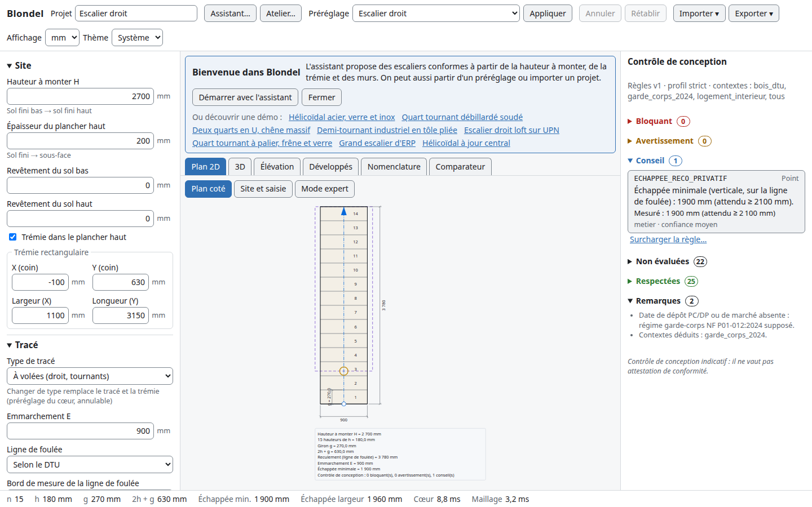

_01 — Première visite : bandeau d'accueil au-dessus des vues (assistant, démos). Il disparaît dès la première modification ou sur « Fermer »._

L'écran est une grille de trois colonnes, entre une barre d'outils et une barre d'état. Elle occupe toute la fenêtre, sans défilement de la page ; chaque panneau défile seul.

| Zone                                | Contenu                                                                                                                                                                 | Largeur                            |
| ----------------------------------- | ----------------------------------------------------------------------------------------------------------------------------------------------------------------------- | ---------------------------------- |
| **Barre d'outils** (haut)           | nom du projet, Assistant…, Atelier…, Préréglage + Appliquer, Annuler / Rétablir, Importer ▾, Exporter ▾, unité d'affichage, thème ; messages et badges d'autosauvegarde | toute la largeur, passe à la ligne |
| **Paramètres** (gauche)             | formulaire du projet en 8 sections repliables (§ 4)                                                                                                                     | 260 à 320 px                       |
| **Vues** (centre)                   | accueil, barre d'erreurs, 6 onglets : Plan 2D, 3D, Élévation, Développés, Nomenclature, Comparateur (§ 3)                                                               | reste                              |
| **Contrôle de conception** (droite) | résultats des règles par sévérité, puis prédimensionnement indicatif (§ 5)                                                                                              | 260 à 340 px                       |
| **Barre d'état** (bas)              | n, h, g, 2h + g, échappée minimale et sur la largeur, temps de calcul (cœur, maillage), « Calcul… », erreurs                                                            | toute la largeur                   |

**Liens entre panneaux** : la **sélection** est partagée.

- Un clic sur une règle du contrôle de conception, une marche du plan ou de l'élévation, une pièce en 3D, une ligne de nomenclature ou de prédimensionnement sélectionne l'élément.
- L'élément sélectionné est surligné en **orange** partout où il apparaît.

## 3. Les vues centrales

Les captures des § 3 à 5 utilisent la démo « Quart tournant débillardé soudé » (limon acier soudé autour d'un jour en arc, marches chêne, garde-corps verre).

### 3.1 Plan 2D — trois modes

Un groupe de trois boutons à bascule en tête de vue : **Plan coté** (par défaut), **Site et saisie**, **Mode expert**.

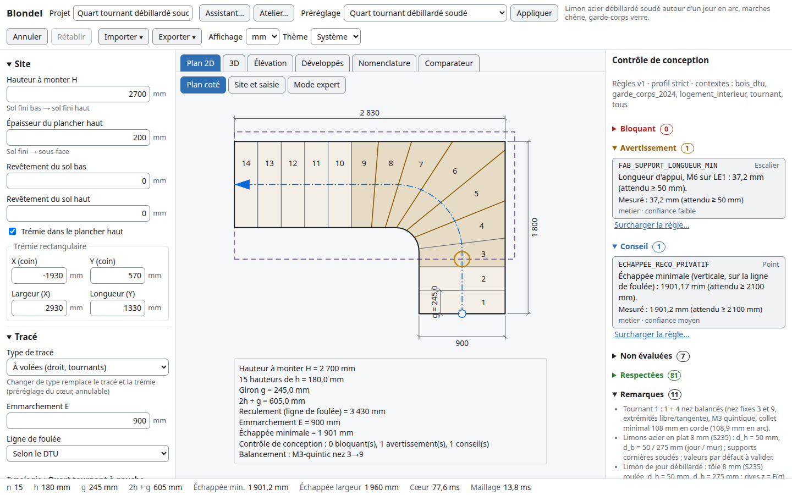

_02 — Plan coté :_

- _dessin d'atelier (SVG exporté) avec numéros de marches, ligne de foulée fléchée, trémie en violet pointillé et cotes ;_
- _cartouche récapitulatif en dessous ;_
- _clic sur une marche pour la sélectionner ;_
- _ni zoom ni déplacement._

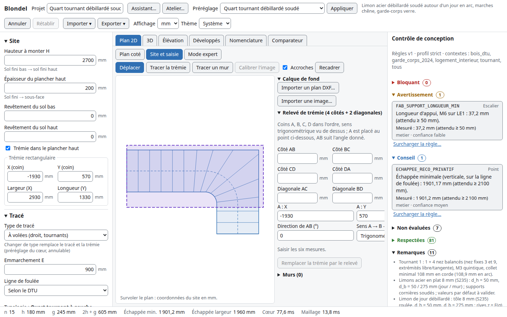

_03 — Site et saisie : éditeur graphique du site._

- _Outils : Déplacer, Tracer la trémie, Tracer un mur, Calibrer l'image, Accroches, Recadrer._
- _Panneau latéral : calque de fond (import DXF ou image), relevé de trémie (4 côtés + 2 diagonales), liste des murs._
- _Molette : zoom ; glisser : déplacement ; accroches aux extrémités, milieux et intersections._

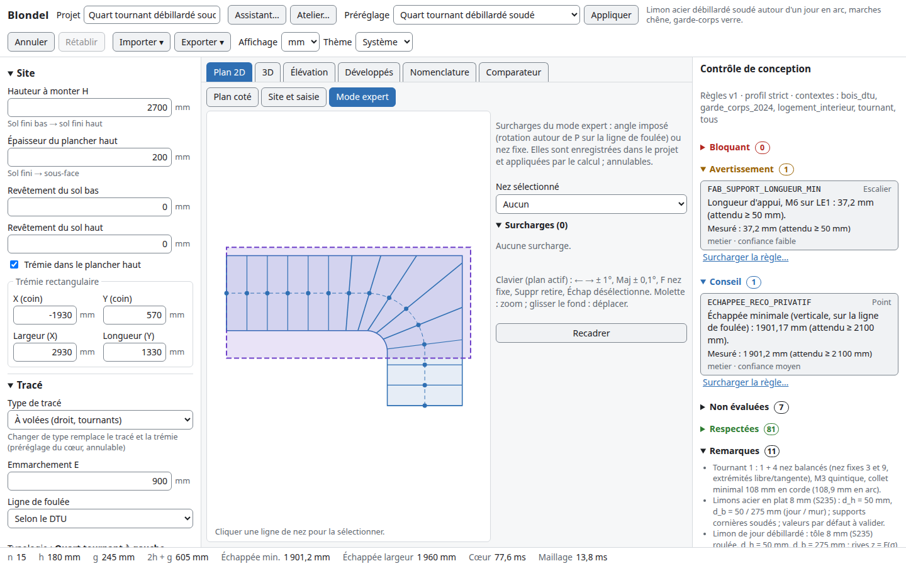

_04 — Mode expert : retouche des lignes de nez des marches balancées._

- _On clique une ligne, puis on la fait pivoter (poignée, ou flèches du clavier ±1°, Maj ±0,1°), ou on la fixe (F)._
- _Les surcharges sont listées et retirables dans le panneau de droite._

### 3.2 3D

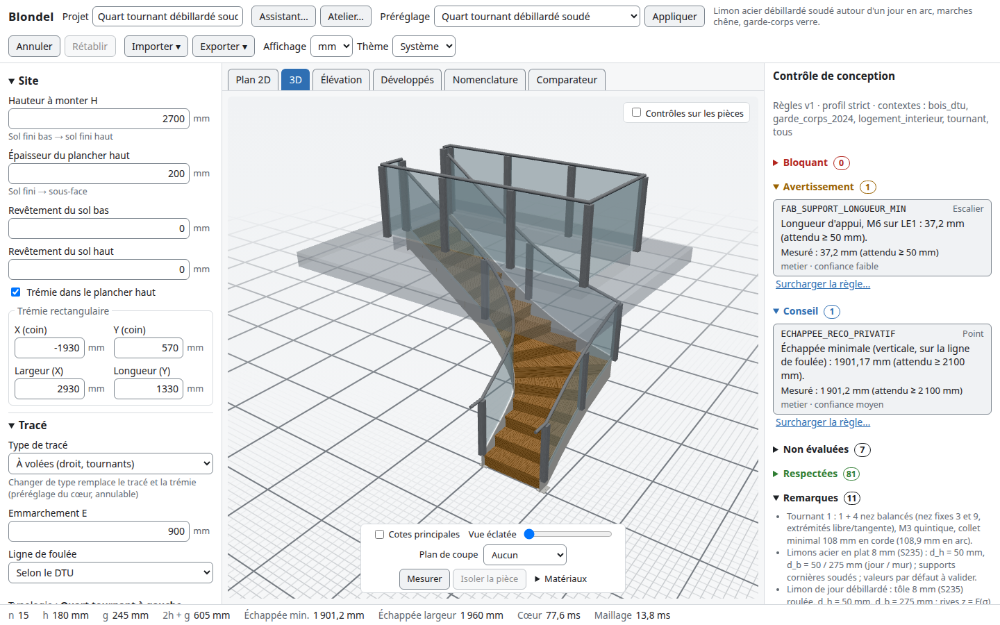

_05 — Vue 3D : orbite et zoom à la souris ; matériaux réalistes, dalle haute translucide ; clic sur une pièce pour la sélectionner._

- _Barre d'outils en bas : Cotes principales, Vue éclatée (curseur), Plan de coupe (X, Y, Z et position), Mesurer, Isoler la pièce, Matériaux (aperçu seulement, non enregistré)._
- _Encart en haut à droite : contrôles sur les pièces._

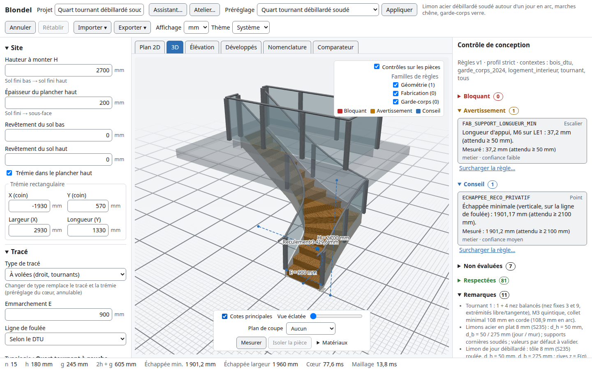

_06 — « Contrôles sur les pièces » coché : les pièces en défaut sont teintées selon la sévérité, avec des familles de règles filtrables et une légende. « Cotes principales » ajoute H, E et le reculement. Quand on charge une démo, ces surcouches sont masquées au départ._

### 3.3 Élévation

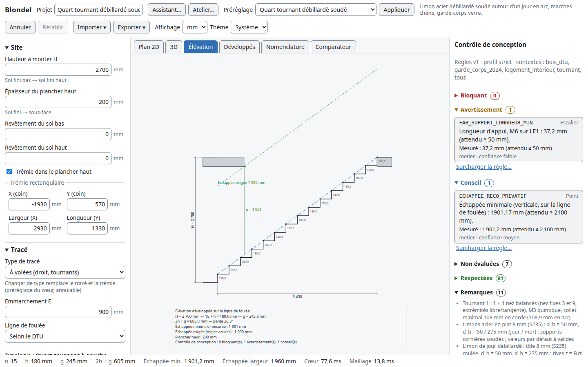

_07 — Élévation développée le long de la ligne de foulée : hauteurs de marches, échappée mesurée et exigée, plancher haut, cartouche. Clic sur une marche pour la sélectionner._

### 3.4 Développés

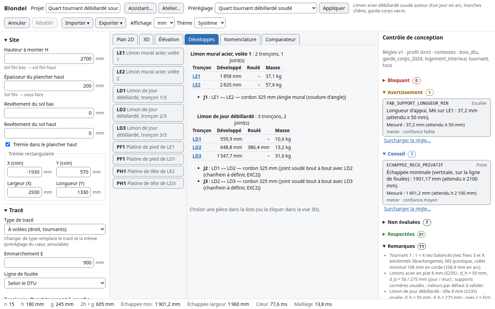

_08 — Liste des pièces qui ont une mise à plat (repère + nom). Pour les limons en tronçons : tableau des tronçons (développé, roulé, masse) et liste des joints soudés._

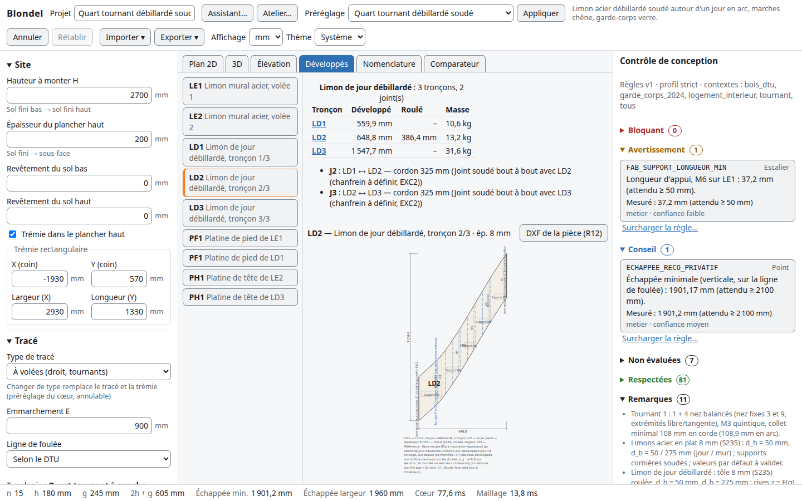

_09 — Pièce sélectionnée : gabarit coté, avec le bouton « DXF de la pièce (R12) »._

### 3.5 Nomenclature

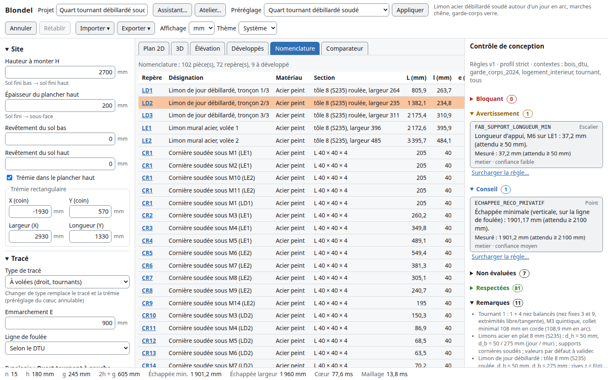

_10 — Tableau des pièces : repère, désignation, matériau, section, L, l, e, quantité, volume, masse, avec une ligne Total. Un clic sur un repère sélectionne la pièce. L'en-tête reste figé au défilement._

### 3.6 Comparateur

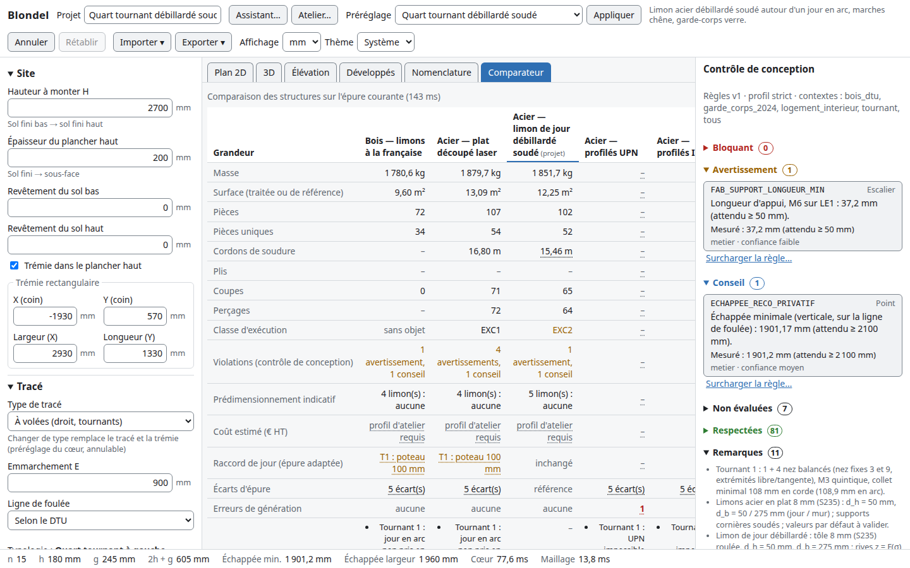

_11 — Une colonne par structure possible, calculée sur la même épure. Grandeurs comparées : masse, surfaces, pièces, soudures, coupes, perçages, classe d'exécution, violations, prédimensionnement, coût estimé._

- _La colonne du projet est marquée « (projet) » ; les cellules problématiques sont colorées._
- _En pied de tableau, « Appliquer » change de structure._
- _Le coût n'apparaît que si le profil d'atelier est complet (§ 7)._

## 4. Panneau des paramètres (colonne gauche)

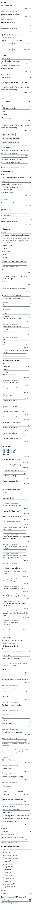

_12 — Panneau complet, toutes sections dépliées, sur la démo acier. Il mesure environ 8 600 px de haut._

Huit sections repliables, dans l'ordre :

| Section                  | Contenu principal                                                                                                                                                                                                                                                                                 |
| ------------------------ | ------------------------------------------------------------------------------------------------------------------------------------------------------------------------------------------------------------------------------------------------------------------------------------------------- |
| **Site**                 | hauteur à monter H, épaisseur du plancher haut, revêtements bas et haut, trémie (case + coin X/Y, largeur, longueur)                                                                                                                                                                              |
| **Tracé**                | type (volées / hélicoïdal), emmarchement E, ligne de foulée, typologie calculée, une longueur par volée, un bloc par tournant (sens, marches balancées ou palier, jour : angle vif, arrondi ou poteau), Ajouter / Retirer une volée, Recaler volées et trémie ; paramètres propres à l'hélicoïdal |
| **Découpage**            | nombre de hauteurs n (auto ou imposé), hauteur de marche cible, giron cible, correction de la 1re hauteur                                                                                                                                                                                         |
| **Balancement**          | méthode (M0 à M6), variante, curseurs α ou λ / p, marches balancées par côté, collet cible                                                                                                                                                                                                        |
| **Marches**              | épaisseur, débord de nez, contremarches (pleines, ajourées, aucune)                                                                                                                                                                                                                               |
| **Structure**            | choix du type de structure, puis ses paramètres, générés dynamiquement par le plugin choisi (sous-groupes repliables : supports, platines, tôle pliée…)                                                                                                                                           |
| **Garde-corps**          | garde-corps de volée et de trémie, remplissage (6 types), poteaux, main courante, matériau                                                                                                                                                                                                        |
| **Contexte de contrôle** | contextes réglementaires (cases), profil strict / souple, date de référence                                                                                                                                                                                                                       |

**Comportement des champs** :

- **Validation** : un champ numérique est validé à **Entrée ou à la perte de focus**, pas à la frappe. Échap rétablit la valeur ; une saisie invalide est signalée immédiatement sous le champ.
- **Champs « automatiques »** : une case « … : automatique » ; décochée, un second champ du même nom apparaît.
- **Unité** : affichée à droite du champ (mm, °).
- **Aides** : aide courte en gris sous le champ ; la mention « Valeur par défaut à valider » signale une valeur non sourcée.

## 5. Contrôle de conception (colonne droite)

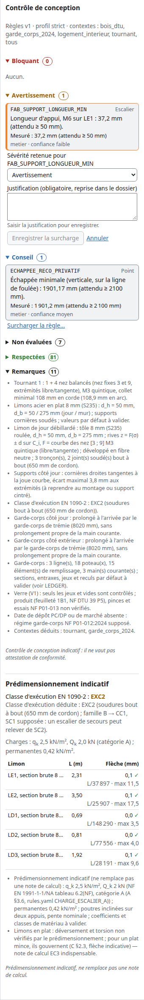

_13 — Colonne droite, avec l'éditeur de surcharge ouvert sous un avertissement._

- **En-tête** : version des règles, profil (strict / souple) et contextes actifs.
- **Groupes par sévérité**, avec un compteur : **Bloquant** (rouge), **Avertissement** (ocre), **Conseil** (bleu), **Non évaluées**, **Respectées** (vert), **Surcharges**, **Remarques** (texte libre du calcul). Les deux listes « Non évaluées » et « Respectées » sont repliées par défaut.
- **Carte de résultat** :
  - identifiant de règle (police à chasse fixe) et localisation (Escalier, Nez 3, Pièce…) ;
  - message ;
  - « Mesuré : … (attendu …) » ;
  - nature, confiance et source.
- Un clic sur la carte sélectionne l'élément concerné dans les vues.
- **« Surcharger la règle… »** : l'utilisateur peut changer la sévérité d'une règle, avec une **justification obligatoire**, reprise dans le dossier PDF.
- **Prédimensionnement indicatif** (sous le contrôle, structures métalliques) : classe d'exécution EN 1090-2, charges, tableau limon par limon (portée, flèche, contrainte, fréquence propre) avec ✓ / ✗.
- **Mention de pied** : « Contrôle de conception indicatif : il ne vaut pas attestation de conformité. »

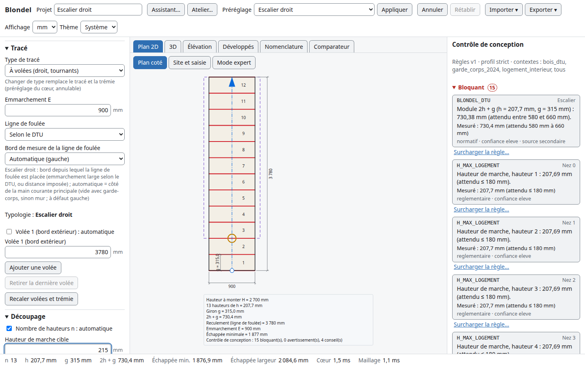

_19 — Cas bloquant : hauteur de marche cible portée à 215 mm sur l'escalier droit. Les marches en défaut sont rouges dans le plan et le groupe « Bloquant » s'ouvre._

## 6. Erreurs et états particuliers

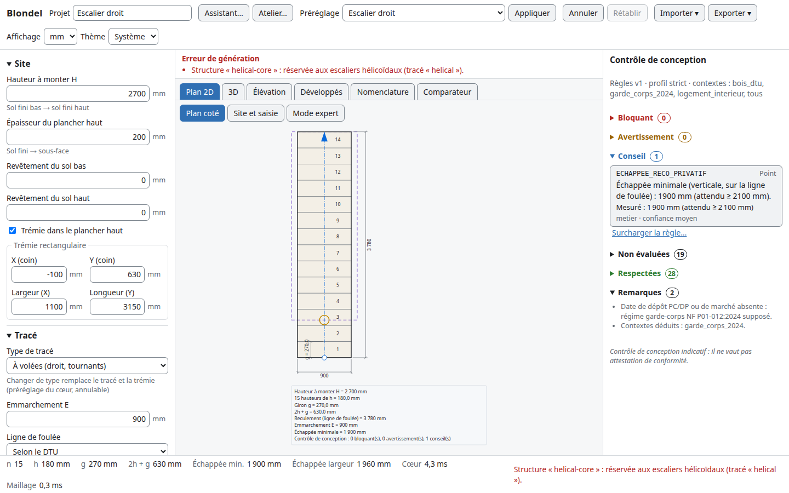

_20 — Erreur de génération : structure hélicoïdale choisie sur un escalier droit._

- _L'erreur s'affiche dans la barre rouge au-dessus des onglets et dans la barre d'état._
- _Le modèle partiel reste affiché._
- _Quand le calcul sait en proposer, des **corrections** apparaissent sous forme de boutons (« Corrections proposées ») ; chacune est annulable._

**États d'une vue** :

| État                        | Affichage                                                     |
| --------------------------- | ------------------------------------------------------------- |
| Calcul en cours sans modèle | « Calcul du modèle… »                                         |
| Aucun modèle                | « Aucun modèle à afficher. » + liste des erreurs              |
| 3D en chargement            | « Chargement de la vue 3D… » (la 3D est chargée à la demande) |
| Rien à afficher             | « Aucune pièce… », « Aucune variante à comparer. », etc.      |

**Messages** (bandeau dans la barre d'outils, avec « Fermer ») :

- démo chargée (description de la démo) ;
- correction appliquée ;
- import refusé ;
- autosauvegarde refusée ou indisponible (badges et actions de secours : restaurer, exporter, supprimer).

## 7. Fenêtres et menus

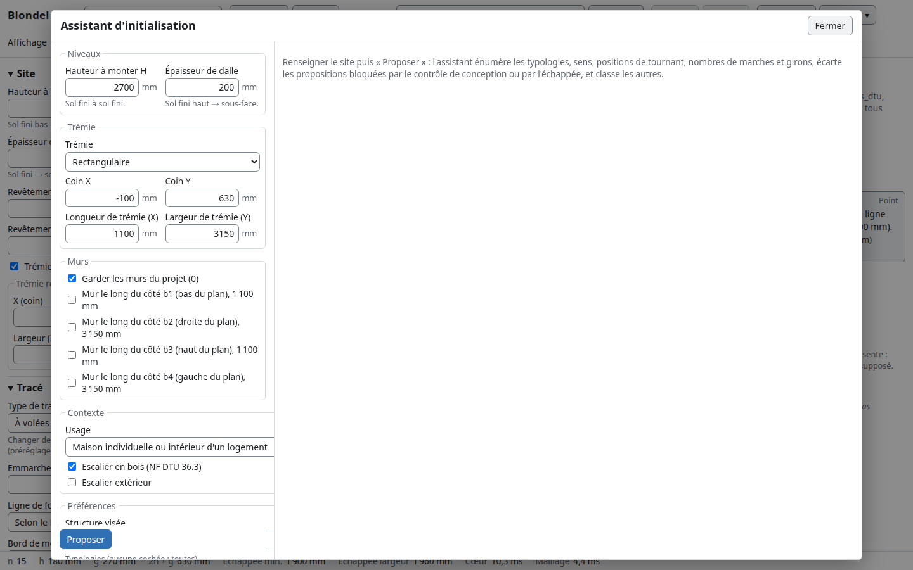

_14 — **Assistant d'initialisation** (fenêtre modale), colonne de saisie :_

- _niveaux (H, dalle) ;_
- _trémie (rectangulaire, relevé, polygonale ou aucune) ;_
- _murs par côté ;_
- _contexte (usage, bois, extérieur) ;_
- _préférences (structure visée, typologies, sens, emmarchement, garde-corps)._

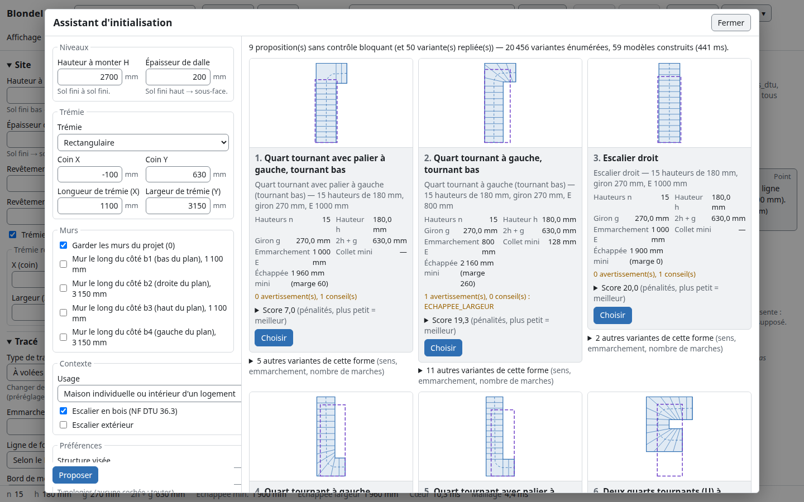

_15 — Propositions classées :_

- _une carte par forme, avec un croquis en plan, des valeurs clés, des avertissements, le détail du score et « Choisir » ;_
- _variantes repliées sous chaque carte ;_
- _« Choisir » remplace le projet (annulable) et ouvre le Plan 2D._

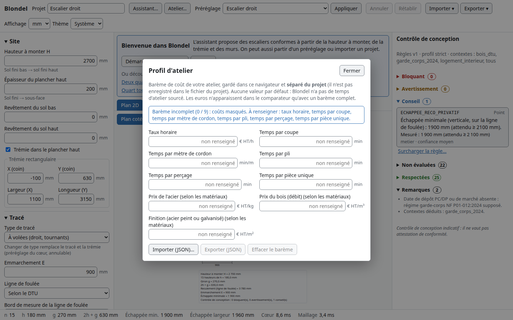

_16 — **Profil d'atelier** : barème de coût (taux horaire, temps unitaires, prix matière, finition). Il est gardé dans le navigateur, **séparé du projet**. Tant qu'il est incomplet, les coûts sont masqués partout. Import et export JSON._

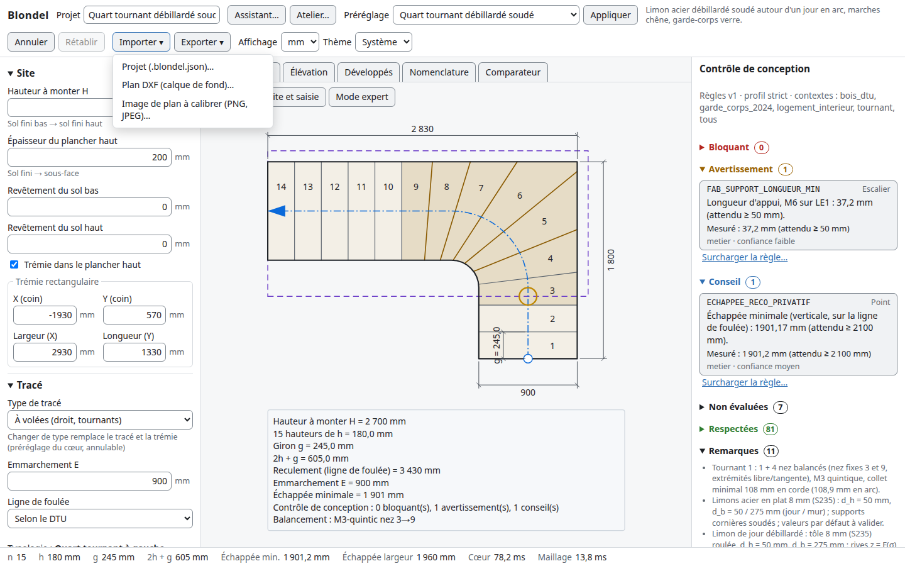

_17 — **Importer** : projet `.blondel.json`, plan DXF (calque de fond), image de plan à calibrer._

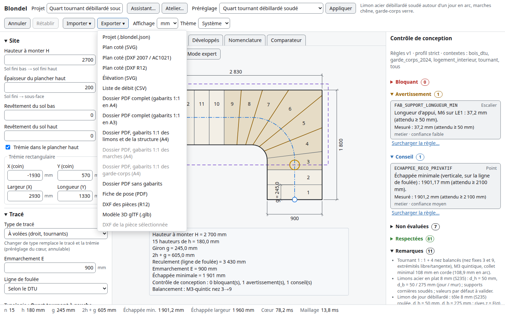

_18 — **Exporter** : 16 entrées à plat._

- _Projet ; plan coté (SVG, DXF 2007, DXF R12) ; élévation SVG ; liste de débit CSV._
- _Six variantes de dossier PDF ; fiche de pose._
- _DXF des pièces ; modèle 3D glTF ; DXF de la pièce sélectionnée._
- _Une entrée indisponible est grisée, avec la raison en infobulle._

**Préréglages** (liste de la barre d'outils, deux groupes) :

- **Basiques** (formes nues) :
  - Escalier droit ;
  - Quart tournant à gauche / à droite ;
  - Deux quarts tournants (U) ;
  - Deux quarts tournants opposés (S) ;
  - Demi-tournant balancé ;
  - Quart tournant avec palier ;
  - Hélicoïdal à fût central.
- **Démo** (escaliers complets et habillés, ouverts directement en 3D) :
  - Hélicoïdal acier, verre et inox ;
  - Quart tournant débillardé soudé ;
  - Deux quarts en U, chêne massif ;
  - Demi-tournant industriel en tôle pliée ;
  - Escalier droit loft sur UPN ;
  - Quart tournant à palier, frêne et verre ;
  - Grand escalier d'ERP ;
  - Hélicoïdal à jour central.
- Une démo sélectionnée affiche sa description d'une ligne à côté de la liste.

## 8. Style visuel actuel

**Pas de design system formalisé** : des variables CSS dans `apps/web/src/styles.css` et quelques feuilles par composant. Aucune bibliothèque de composants ; contrôles natifs du navigateur (select, case, curseur) à peine stylés.

| Jeton              | Clair     | Sombre      | Usage                                          |
| ------------------ | --------- | ----------- | ---------------------------------------------- |
| `--bg`             | `#f6f7f8` | `#15181b`   | fond de page                                   |
| `--panel`          | `#ffffff` | `#1d2125`   | panneaux                                       |
| `--panel-2`        | `#f0f2f4` | `#252a2f`   | boutons, cartes, zones secondaires             |
| `--text`           | `#1d2125` | `#e6e8ea`   | texte                                          |
| `--muted`          | `#5f6770` | `#9aa3ab`   | texte secondaire                               |
| `--border`         | `#d6dade` | `#353b41`   | séparateurs                                    |
| `--control-border` | `#7d868f` | `#6b747d`   | bordure des contrôles                          |
| `--accent`         | `#2f6fb3` | `#6ea8e6`   | onglet actif, bouton principal, liens, conseil |
| `--danger`         | `#b3261e` | `#f28b82`   | bloquant, erreurs                              |
| `--warn`           | `#9a6200` | `#f0b85a`   | avertissement                                  |
| `--ok`             | `#2e7d32` | `#81c995`   | respecté                                       |
| `--selected`       | `#ff7a1a` | (identique) | sélection partagée                             |

**Typographie et formes** :

- **Polices** : police système (`system-ui`) en 14 px / 1,4 ; police à chasse fixe pour les identifiants de règles.
- **Titres** : de 0,95 à 1,1 rem.
- **Formes** : rayon 6 px, espacement de base 0,75 rem, focus en contour bleu de 2 px.

**Thèmes** : Système (par défaut), Clair, Sombre, au choix dans la barre d'outils.

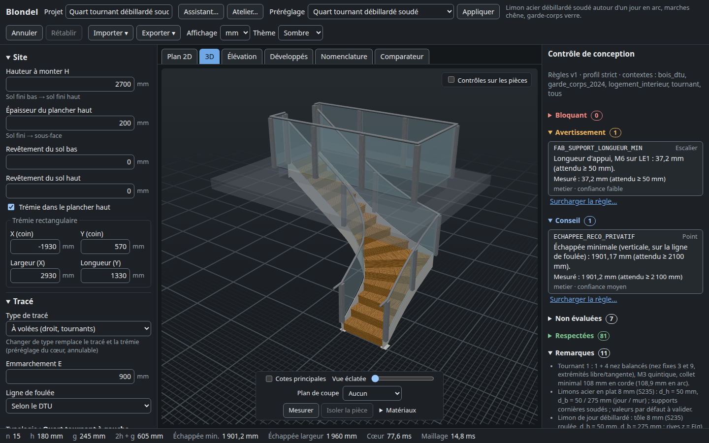

_21 — Thème sombre (démo, onglet 3D)._

**Largeurs d'écran** : un seul point de rupture, à 900 px.

- En dessous, la grille passe sur une colonne, dans cet ordre : barre d'outils, paramètres, vues (60 % de la hauteur), contrôle, barre d'état. C'est alors la page entière qui défile.
- Aucun réglage spécifique pour la tablette ni le grand écran.

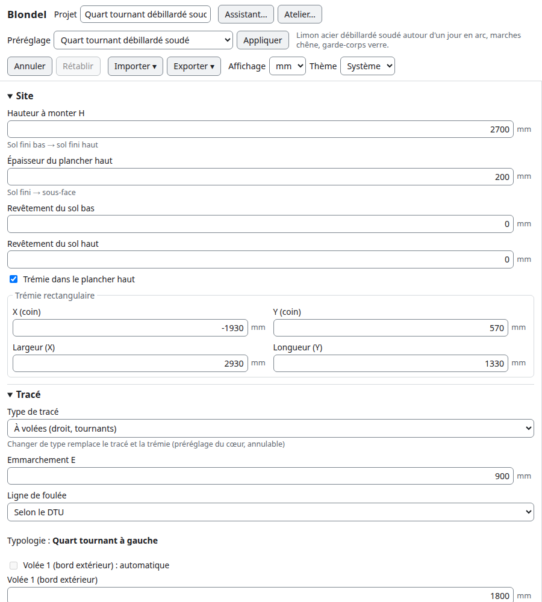

_22 — À 900 px (tablette en paysage), l'écran passe déjà en une colonne : on voit d'abord les paramètres, et la vue 3D chargée par la démo est hors écran._

[Page entière à 390 px (téléphone)](captures/23-mobile-390-page-entiere.png) : 23, image très haute. La page fait **530 px de large** pour un écran de 390 px, d'où un défilement horizontal.

**Accessibilité existante** (vérifiée par des tests automatisés) :

- rôles ARIA sur les onglets, menus et fenêtres ;
- navigation au clavier : flèches dans les onglets et les menus, Échap, focus piégé dans l'assistant ;
- libellés sur tous les champs ;
- contraste des bordures de champs et de boutons (3:1, WCAG 1.4.11) vérifié par un test dans les deux thèmes, mais pas le contraste du texte.

**Raccourcis** :

| Contexte       | Touches                                                                                   |
| -------------- | ----------------------------------------------------------------------------------------- |
| Global         | Ctrl/Cmd+Z annuler ; Ctrl/Cmd+Maj+Z ou Ctrl+Y rétablir                                    |
| Onglets        | ← / →                                                                                     |
| Champs         | Entrée valide, Échap rétablit                                                             |
| Site et saisie | Échap abandonne le tracé, Entrée ferme la trémie, Retour arrière retire le dernier sommet |
| Mode expert    | ← / → ±1°, Maj ±0,1°, F nez fixe, Suppr retire la surcharge, Échap désélectionne          |

## 9. Frictions relevées

Constats faits en rédigeant ce document (lecture du code et captures). Ce ne sont pas des retours d'utilisateurs : aucun test avec des utilisateurs réels n'a encore eu lieu.

**Structure et densité**

1. **Barre d'outils surchargée** : une quinzaine de contrôles de même poids visuel ; elle passe sur deux lignes dès 1 440 px, trois à 900 px. Pas de hiérarchie entre actions fréquentes (annuler, exporter) et rares (atelier, unité).
2. **Panneau des paramètres très long** : environ 8 600 px tout déplié sur une structure acier. Tout est au même niveau : réglages essentiels (H, E, type de tracé) comme réglages d'atelier (pince de perçage, marge à la rive basse).
3. **Menu Exporter** : 16 entrées à plat, dont 6 dossiers PDF, sans regroupement par usage (atelier, client, CAO). Il dépasse du bord droit de l'écran (capture 18).
4. **Contrôle de conception** : les groupes vides restent affichés (« Aucun. ») ; les métadonnées sont techniques (« metier · confiance faible ») ; les identifiants de règles en majuscules sont très visibles alors qu'ils servent surtout de référence.
5. **Comparateur** : tableau plus large que la colonne centrale (colonnes coupées à droite en 1 440 px, capture 11) ; long paragraphe explicatif sous le tableau ; le lien vers le profil d'atelier n'est pas proposé sur place.

**Cohérence**

6. **Libellés divergents pour une même notion** :
   - panneau des paramètres : « Largeur (X) » / « Longueur (Y) », « X (coin) », « Épaisseur du plancher haut » ;
   - assistant : « Longueur de trémie (X) » / « Largeur de trémie (Y) », « Coin X », « Épaisseur de dalle ».
7. **Unités affichées de trois façons** : à droite du champ, dans le libellé (« Distance réelle (mm) », « Angle imposé (°) »), ou absentes (« A : X »).
8. **Validation hétérogène** :
   - champs à Entrée ou à la perte de focus ;
   - angle du mode expert à Entrée seulement (perdu à la perte de focus) ;
   - formulaire de l'assistant local jusqu'à « Proposer ».
9. **Deux modèles de fenêtre** (assistant et atelier), de tailles et de comportements différents.
10. **« Recadrer »** : dans la barre d'outils en mode Site, en bas du panneau en mode Expert. Le plan coté n'a ni zoom ni déplacement.
11. **Contextes de contrôle** : libellés bruts de code (« logement interieur », sans accent), avec l'explication seulement en infobulle.
12. **Champs automatiques** : le libellé est répété (case « … : automatique », puis champ du même nom).
13. **Section « Balancement »** : sur un escalier droit, elle affiche « Sans objet » tout en laissant les champs modifiables.

**Visuel**

14. **Couleurs de la 3D** : codées à part (sévérités, sélection, trémie `#6e40c9`), elles diffèrent légèrement des jetons et ne suivent pas le thème sombre.
15. **Six tailles de texte secondaire voisines** (0,78 à 0,9 rem) et trois tailles de titre.
16. **Débordements** : champs coupés dans l'assistant (Usage, bouton « Proposer » sur le contenu) et dans le relevé de trémie (captures 03 et 14).

**Écrans étroits et accessibilité**

17. **Une seule mise en page de repli**, dès 900 px : la vue principale passe sous un long formulaire, et le téléphone défile à l'horizontale. Le panneau latéral du plan (largeur fixe) et les encarts 3D ne sont pas adaptés.
18. **Accessibilité** :
    - les lignes du prédimensionnement sont cliquables mais pas atteignables au clavier ;
    - le plan « Site et saisie » est interactif mais annoncé comme une image ;
    - la barre d'erreurs est annoncée comme un statut, pas comme une alerte.

## 10. Vocabulaire du métier

Glossaire complet (FR ↔ EN, 80 termes) : `docs/SPEC.md` § 9. Les termes les plus présents à l'écran :

| Terme                                                | Sens                                                                  |
| ---------------------------------------------------- | --------------------------------------------------------------------- |
| Hauteur à monter **H**                               | du sol fini bas au sol fini haut                                      |
| Hauteur de marche **h**, nombre de hauteurs **n**    | H = n × h                                                             |
| **Giron g**                                          | profondeur de marche, mesurée sur la ligne de foulée                  |
| **2h + g** (module de Blondel)                       | indice de confort, idéalement entre 60 et 64 cm                       |
| **Emmarchement E**                                   | largeur utile de l'escalier                                           |
| **Ligne de foulée**                                  | trajet théorique du pied, où l'on mesure le giron                     |
| **Reculement**                                       | longueur de l'escalier projetée au sol                                |
| **Échappée**                                         | hauteur libre au-dessus des marches, sous le plancher haut            |
| **Trémie**                                           | ouverture dans le plancher haut                                       |
| **Volée**, **palier**, **tournant**                  | partie droite, plateforme, changement de direction                    |
| **Marches balancées**, **balancement**               | marches d'un tournant réparties pour garder un giron régulier         |
| **Jour**, **collet**                                 | vide intérieur du tournant ; bout étroit d'une marche balancée        |
| **Limon** (à la française, à l'anglaise, débillardé) | pièce qui porte les marches                                           |
| **Développé**                                        | mise à plat d'une pièce pour la fabriquer                             |
| **Garde-corps**, **main courante**, **remplissage**  | protection contre la chute ; élément saisi ; barreaux, verre, câbles… |
| **Classe d'exécution (EXC)**                         | niveau d'exigence de fabrication métallique (EN 1090-2)               |

## 11. Régénérer les captures

```sh
pnpm ux:captures                       # construit l'application puis capture (≈ 1 min)
E2E_SKIP_BUILD=1 pnpm ux:captures      # réutilise apps/web/dist (construit avec BASE_PATH=/blondel/)
CAPTURES_DIR=/tmp/x pnpm ux:captures   # ailleurs que dans docs/ux/captures/
```

**Fonctionnement** :

- **Script** : `apps/web/e2e/captures/ux.captures.ts` (Playwright, Chromium, fenêtre de 1 440 × 900, première visite à chaque cas). Il n'est pas lancé par `pnpm e2e`.
- **Noms de fichiers** : ils sont cités par ce document ; en renommer un, c'est aussi corriger le document.
- **Rendu 3D** : fait sans GPU (SwiftShader), avec des teintes un peu différentes d'un poste réel.
